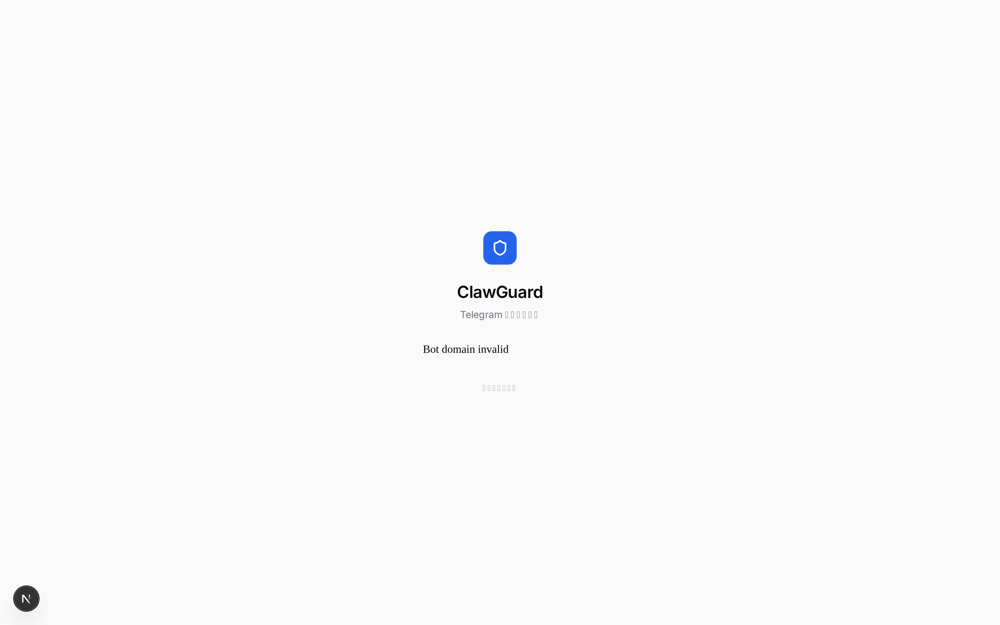
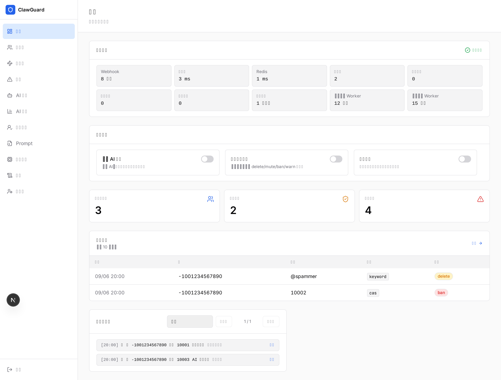

# 🛡️ ClawGuard

[](https://go.dev)
[](https://nextjs.org)
[](https://www.postgresql.org)
[](https://redis.io)
[](./LICENSE)
[](https://github.com/w0ven/clawguard/actions/workflows/docker-publish.yml)
[](https://github.com/w0ven/clawguard/stargazers)

[English](./en_README.md) · [系统设计](./docs/DESIGN.md) · [本地开发](./docs/development.md) · [安全披露](./SECURITY.md)

> 面向 Telegram 群组的治理系统：入群验证、洪泛防护、规则过滤、CAS、AI 审核、信任状态机、定时消息，以及 Web / Mini App 管理后台。策略在面板里配，运行状态可回看、可回滚。





登录页是实拍。总览用本地面板 + 示意数据截的，不是生产数据。

---

## 📜 目录

- [✨ 核心特性](#-核心特性)
- [🧭 架构概览](#-架构概览)
- [🚀 快速开始](#-快速开始)
- [📖 使用指南](#-使用指南)
- [🖥️ Web 与 Mini App](#️-web-与-mini-app)
- [🔐 入群验证](#-入群验证)
- [🚨 入群洪泛防护](#-入群洪泛防护)
- [🛡️ 规则过滤与反垃圾](#️-规则过滤与反垃圾)
- [🧠 AI 审核与信任](#-ai-审核与信任)
- [🔧 配置说明](#-配置说明)
- [🚢 发布与升级](#-发布与升级)
- [📂 项目结构](#-项目结构)
- [🤝 贡献](#-贡献)
- [📄 许可证](#-许可证)
- [🙏 致谢](#-致谢)

---

## ✨ 核心特性

| 特性 | 描述 |
| :--- | :--- |
| 🔐 **入群验证** | 按钮、算术题、图片算术题、Emoji 四选一、Cloudflare Turnstile；任务带租约，重启后续跑。 |
| 🚨 **洪泛防护** | 短窗口集中涌入时临时处理新账号，不波及群内老成员；Redis Lua 原子状态机。 |
| 🧹 **规则过滤** | 关键词、正则、用户名黑名单、链接白名单、未毕业加严、速率限制、警告升级。 |
| 🤖 **CAS 联动** | 同步 Combot Anti-Spam 黑名单，入群命中可直接封禁。 |
| 🧠 **AI 审核** | 文本、图片、视频抽帧、名片/投票/地点等结构化内容；多 Provider 与 fallback。 |
| 🪪 **信任状态机** | `new → trusted / suspicious / banned`，毕业靠干净消息累计，不靠「挂几天」。 |
| 📱 **Web + Mini App** | 完整管理后台；Telegram 内也能管群、复核 AI、改 Prompt。 |
| ⏰ **定时消息** | 每群最多 20 条，支持间隔或每日多个北京时间，带运行历史。 |
| 💾 **可回滚发布** | Compose 固定 `sha-<commit>` 镜像，升级失败自动回到旧版本。 |

---

## 🧭 架构概览

```text
Telegram / Browser
        │
HTTPS 入口（Cloudflare Tunnel 或自有反代）
        │
     Caddy :80
        │
        ├── Next.js 16 Web :3000
        └── Go Bot + Echo API :8080
                    │
            PostgreSQL 16   Redis 7 AOF
```

审核流水线（简化）：

```text
入站消息
  ├─ 硬过滤（关键词 / 正则 / 用户名 / 链接）
  ├─ 未毕业限制（链接 / 转发 / 媒体 / 速率）
  ├─ 关键词自动回复（不短路后续审核）
  ├─ AdKiller 广告预筛
  └─ AI（文本 / 图片 / 视频抽帧）
```

> [!NOTE]
> 当前按 **单 bot 实例** 设计。入群防护状态在 Redis 里，但定时消息和日报还没有分布式选主，不要把 bot 扩成多副本。

---

## 🚀 快速开始

> [!TIP]
> 推荐用已发布的 Docker 镜像。当前生产镜像标签：`sha-92b751a`。

### 前置条件

- Linux 主机，Docker Engine + Compose v2
- Telegram Bot Token（[@BotFather](https://t.me/BotFather)）
- HTTPS 公网域名，或 Cloudflare Tunnel
- 你自己的 Telegram 数字 ID（填进 `SUPER_ADMIN_IDS`）

### 1. 克隆并生成密钥

```bash
git clone https://github.com/w0ven/clawguard.git
cd clawguard
cp .env.example .env
openssl rand -hex 32
```

把命令输出分别填进 `WEBHOOK_SECRET`、`POSTGRES_PASSWORD`、`REDIS_PASSWORD`、`JWT_SECRET`、`ENCRYPTION_KEY`。每个值都要独立生成。

### 2. 填写启动项

至少改这些：

```env
BOT_TOKEN=123456:ABC...
BOT_USERNAME=your_bot
TELEGRAM_LOGIN_BOT_USERNAME=your_bot
WEBHOOK_SECRET=...          # openssl rand -hex 32
SUPER_ADMIN_IDS=123456789
POSTGRES_PASSWORD=...
REDIS_PASSWORD=...
JWT_SECRET=...
ENCRYPTION_KEY=...          # 生产必须稳定，丢了就解不开已存的 LLM Key
PUBLIC_BASE_URL=https://your-domain.example
CLAWGUARD_TAG=sha-92b751a
```

完整模板见 [`.env.example`](./.env.example)。

| 分组 | 变量 | 说明 |
| :--- | :--- | :--- |
| Telegram | `BOT_TOKEN`, `BOT_USERNAME`, `TELEGRAM_LOGIN_BOT_USERNAME` | Bot 与 Web 登录身份 |
| Webhook | `WEBHOOK_SECRET`, `PUBLIC_BASE_URL`, `WEB_BASE_URL` | webhook 校验和公网地址 |
| Admin | `SUPER_ADMIN_IDS`, `ADMIN_TELEGRAM_IDS` | 初始 owner / admin |
| PostgreSQL | `POSTGRES_*` | 数据库 |
| Redis | `REDIS_*` | 状态、限流、入群防护 |
| Auth | `JWT_SECRET`, `ENCRYPTION_KEY` | 登录 JWT 与 Provider Key 加密 |
| Turnstile | `TURNSTILE_SITE_KEY`, `TURNSTILE_SECRET_KEY` | 入群验证码（可选） |
| Runtime | `CLAWGUARD_TAG` | 固定镜像版本，生产不要用漂浮的 `latest` |
| Web build | `NEXT_PUBLIC_BOT_USERNAME`, `NEXT_PUBLIC_TURNSTILE_SITE_KEY` | **构建时**写入前端 bundle |

> [!IMPORTANT]
> `ENCRYPTION_KEY` 必须随数据库一起备份。更换后，面板里已保存的 LLM API Key 全部失效。
>
> `NEXT_PUBLIC_*` 写在 GitHub Repository Variables 里，只改生产机 `.env` 不会改变已经构建好的前端。

### 3. 启动

```bash
docker compose pull
docker compose up -d
docker compose ps
curl -fsS http://127.0.0.1:8080/readyz
```

Compose 会拉：

```text
kelework/clawguard-bot:sha-92b751a
kelework/clawguard-web:sha-92b751a
```

bot 启动时自动跑 goose migration、注册 webhook、拉起后台任务。`/readyz` 只有 PostgreSQL 和 Redis 都可用才返回 ready。

服务默认只绑回环：

| 端口 | 用途 |
| :--- | :--- |
| `127.0.0.1:8090` | Caddy 对外入口（Tunnel / 反代指这里） |
| `127.0.0.1:8080` | Bot API / webhook / health |
| `127.0.0.1:3000` | Web 后台 |

### 4. 把 HTTPS 指过来

Cloudflare Tunnel 示例：

```yaml
ingress:
  - hostname: your-domain.example
    service: http://127.0.0.1:8090
  - service: http_status:404
```

域名必须和 `PUBLIC_BASE_URL` 一致，且是 HTTPS。

### 5. 授权第一个群

1. 把 bot 拉进群，设为管理员，至少给 **删除消息、限制成员、封禁成员**。
2. 用 owner 账号打开 `https://your-domain.example`，走 Telegram Login；或私聊 bot 发 `/config`。
3. 「群授权」里填 chat ID。
4. 「群管理」里按群打开验证、过滤、AI。

> [!IMPORTANT]
> 未授权的群会被自动拒绝。AI 审核默认关着，配好 Provider / Model 后再按群启用。

Fork 或离线构建见 [本地开发](./docs/development.md)。

---

## 📖 使用指南

### 🔑 准备 Bot

1. [@BotFather](https://t.me/BotFather) → `/newbot` 拿到 Token 和用户名。
2. `/setprivacy` 设为 **Disable**，否则 bot 看不到普通群消息。
3. `/setjoingroups` 保持允许。
4. Mini App：把 Web App 域名配成与 `PUBLIC_BASE_URL` 相同的 HTTPS 主机。
5. 自己的数字 ID 可用 [@userinfobot](https://t.me/userinfobot) 查询，写入 `SUPER_ADMIN_IDS`。

### ⌨️ 群内管理员命令

| 命令 | 说明 |
| :--- | :--- |
| `/start` `/help` | 介绍和命令列表 |
| `/status` | 本群今日统计 |
| `/trust` | 回复消息或 `@用户` 查看信任状态 |
| `/warn` | 警告并进入累计升级 |
| `/unban` | 解封并清理本地封禁 |
| `/spam` | 回复 / `@用户` / user ID 快捷封禁 |
| `/cas` | 查询 CAS |
| `/warn_status` | 警告记录 |
| `/config` | 一次性管理后台登录链接 |

私聊管理员可用 `/start`、`/help`、`/status`、`/trust <user_id>`、`/config`。

---

## 🖥️ Web 与 Mini App

后台覆盖：总览、群管理、全局策略、群授权、违规、AI 复核、AI 统计、信任、Prompt、模型、审计、管理员、系统开关。

群配置页包括：基础、验证、入群防护、过滤、关键词回复、警告、反垃圾、AI、动作反馈、日志、审计、定时消息。

**Mini App**：私聊底部「管理面板」打开 `/miniapp`。服务端校验 Telegram `initData`，只允许 `admins` 表里的人登录，复用 JWT / CSRF / 群范围权限。

- 手机：底部高频导航 +「全部功能」
- 桌面 Web：原布局
- 跟随 Telegram 明暗主题和安全区

分段保存 Prompt / AdKiller / 全局策略；整份保存带 `version` 乐观锁，两个页面不会互相覆盖。

---

## 🔐 入群验证

新成员先被限制权限，完成挑战后再恢复。验证任务写 PostgreSQL，带到期时间、租约和重试。

| 方式 | 说明 |
| :--- | :--- |
| 按钮 | 点按确认 |
| 算术题 | 文本口算 |
| 图片算术题 | 渲染题目图；失败或超时会删原图 |
| Emoji 四选一 | 选对指定表情 |
| Turnstile | Cloudflare 人机验证 |

可选：入群前跑 CAS、Bio 关键词 / AI。AdKiller 开启时，简介先广告预筛，命中再按分段动作处理。

---

## 🚨 入群洪泛防护

只处理短时间涌进来的**新账号**，不会对老成员做批量动作。

| 参数 | 默认 | 含义 |
| :--- | ---: | :--- |
| `join_threshold` | 20 | 窗口内达到此人数进入防护 |
| `join_window_seconds` | 60 | 统计窗口（秒） |
| `protection_duration_seconds` | 900 | 防护持续 15 分钟 |
| `temporary_ban_seconds` | 3600 | 新账号临时封禁 60 分钟 |
| `max_pending_verifications` | 30 | 待验证接近上限时提前防护 |

防护期间不发验证题、不打 CAS / Bio / AI、不逐人刷提示。到期自动恢复。状态在 Redis，重启可续。

---

## 🛡️ 规则过滤与反垃圾

- 关键词 / 正则，可配多种动作
- 未毕业用户：限制链接、转发、媒体、邀请、每分钟条数
- 结构化文本也会进关键词：联系人、投票、地点卡片、发票、文件名
- 其他 bot 可审核、移出、封禁或忽略
- 识别 sender chat、via bot、编辑消息、跨聊天引用、t.me 预览
- 关键词自动回复支持模糊 / 精确 / 正则；**命中回复不会跳过审核**

---

## 🧠 AI 审核与信任

支持 OpenAI Chat Completions、OpenAI Responses、Anthropic Messages 兼容网关。Provider、模型、Key、能力标签、优先级、探活在后台维护。

```text
new ──干净消息累计──► trusted
 │                      │
 └──► suspicious ◄──────┘   明确封禁 → banned
          │
   长期无发言的 new → archived
```

- 毕业看 `graduate_after_messages`（默认 5 条 AI 通过的干净消息）
- 已毕业真人不会被普通内容审核自动打回 `suspicious`
- 关键词 / 链接等硬规则对谁都有效
- 视频按真实媒体抽帧，caption 不改变是否抽帧

---

## 🔧 配置说明

最终策略：

```text
代码内置默认值  →  global_config  →  group.config
```

群配置只存差异。`null` / 缺省表示继承全局。

生产模式会拒绝：

- 短于 32 字符的 `JWT_SECRET` / `WEBHOOK_SECRET` / `ENCRYPTION_KEY`
- 占位符密钥
- 非 HTTPS 的 `PUBLIC_BASE_URL`

Webhook 地址是 `PUBLIC_BASE_URL/webhook/<WEBHOOK_SECRET>`，日志里不会打印 secret path。

---

## 🚢 发布与升级

合并到 `main` 后，GitHub Actions 构建：

```text
kelework/clawguard-bot:latest
kelework/clawguard-bot:sha-<commit>
kelework/clawguard-web:latest
kelework/clawguard-web:sha-<commit>
```

生产请钉死 `CLAWGUARD_TAG=sha-<commit>`。镜像带 `org.opencontainers.image.revision`，可在主机上核对 commit。

```bash
# 在放置 Compose 的目录
git pull
bash scripts/deploy-production.sh sha-<commit>
```

脚本会备份数据库、记下旧镜像、升级 bot/web、核对健康和 OCI revision；失败则回到旧镜像。

升级后检查：

```bash
bash scripts/prod-smoke.sh \
  --since 5m \
  --url https://your-domain.example \
  --compose docker-compose.yml
```

备份与恢复演练见 [docs/restore-rehearsal.md](./docs/restore-rehearsal.md)。

---

## 📂 项目结构

```text
clawguard/
├── bot/                       # Go Bot + 管理 API
│   ├── cmd/clawguard/
│   ├── cmd/migrate/
│   ├── internal/{ai,api,bot,scheduler,store,worker}
│   └── migrations/            # goose，当前到 00031
├── web/                       # Next.js 16 管理后台
├── scripts/                   # 升级、备份、smoke
├── docs/
│   ├── DESIGN.md
│   ├── development.md
│   └── restore-rehearsal.md
├── docker-compose.yml
├── Caddyfile
└── .env.example
```

---

## 🤝 贡献

欢迎 Issue 和 Pull Request。开发、测试、PR 约定见 [CONTRIBUTING.md](./CONTRIBUTING.md) 和 [docs/development.md](./docs/development.md)。

安全问题请按 [SECURITY.md](./SECURITY.md) 私下报告，不要开公开 Issue。

---

## 📄 许可证

[MIT](./LICENSE) © 2026 w0ven

---

## 🙏 致谢

- [telebot](https://github.com/tucnak/telebot) — Telegram Bot API
- [Echo](https://echo.labstack.com/) — Go HTTP
- [Next.js](https://nextjs.org/) — 管理后台
- [sqlc](https://sqlc.dev/) / [goose](https://github.com/pressly/goose) — 数据访问与迁移
- [Combot CAS](https://combot.org/cas) — 公开反垃圾名单

---

如果这个项目对你有帮助，请给个 Star ⭐️
