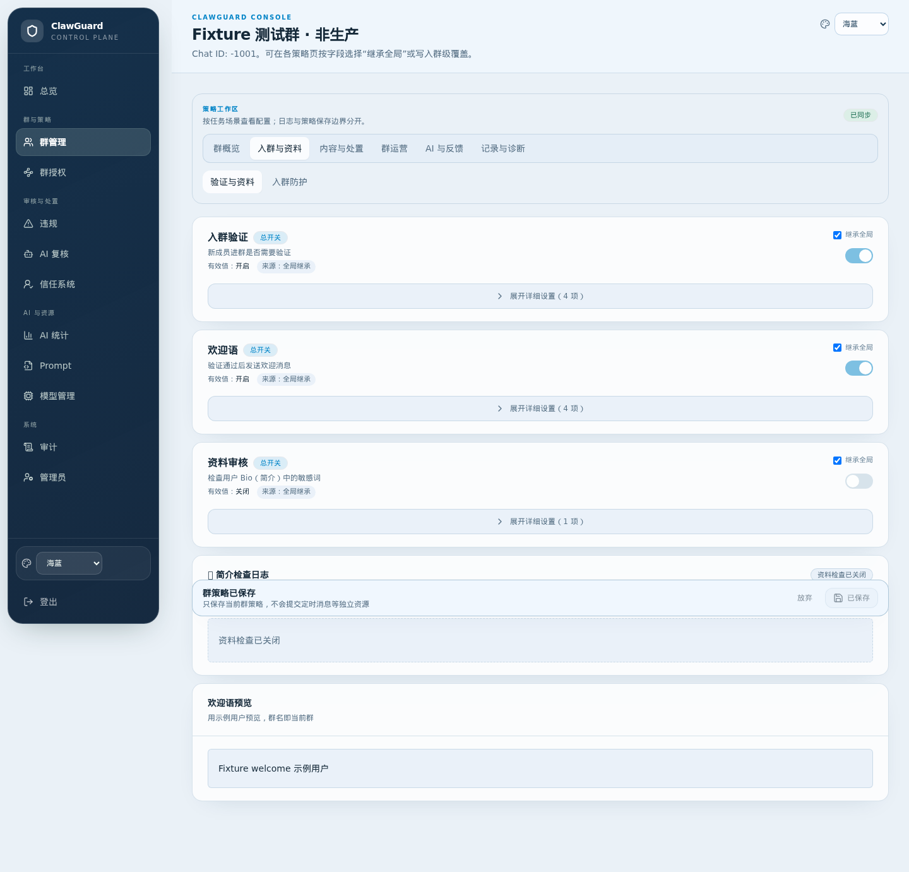
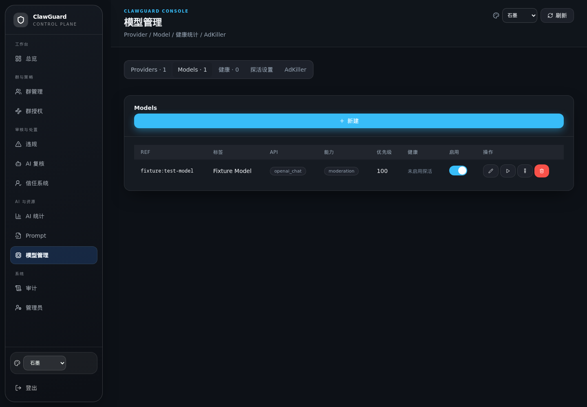
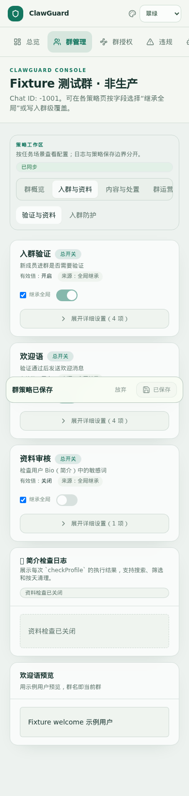

# 🛡️ ClawGuard

[](https://go.dev)
[](https://nextjs.org)
[](https://www.postgresql.org)
[](https://redis.io)
[](./LICENSE)
[](https://github.com/w0ven/clawguard/actions/workflows/docker-publish.yml)
[](https://github.com/w0ven/clawguard/stargazers)

[中文文档](./README.md) · [Design](./docs/DESIGN.md) · [Development](./docs/development.md) · [Security](./SECURITY.md)

> Telegram group governance: join verification, flood protection, rule filters, CAS, AI moderation, a trust state machine, scheduled messages, and a Web / Mini App console.


<details>
<summary>Console and mobile screenshots</summary>

**Dashboard (emerald)**


**Group configuration (ocean blue)**



**Model management (graphite)**



**Mobile**



</details>

The login page is a live capture. The console screenshots above are from the actual Next React UI using a local test fixture and simulated data, not production records; the mobile / Mini App view shows layout and SDK simulation only and does not represent a real Telegram test.

---

## 📜 Contents

- [✨ Features](#-features)
- [🧭 Architecture](#-architecture)
- [🚀 Quick start](#-quick-start)
- [📖 Usage](#-usage)
- [🖥️ Web and Mini App](#️-web-and-mini-app)
- [🔧 Configuration](#-configuration)
- [🚢 Release and upgrade](#-release-and-upgrade)
- [🤝 Contributing](#-contributing)
- [📄 License](#-license)

---

## ✨ Features

| Feature | What it does |
| :--- | :--- |
| 🔐 **Join verification** | Button, arithmetic, image arithmetic, emoji, Turnstile. Jobs are leased and survive restarts. |
| 🚨 **Join-flood guard** | Handles bursts of new accounts only. Redis Lua atomic state. |
| 🧹 **Filters** | Keywords, regex, usernames, links, ungraduated limits, rate limits, warning escalation. |
| 🤖 **CAS** | Combot Anti-Spam sync; hits can ban on join. |
| 🧠 **AI moderation** | Text, images, video frames, structured cards. Multi-provider fallback. |
| 🪪 **Trust machine** | `new → trusted / suspicious / banned`. Graduation is clean-message count, not calendar days. |
| 📱 **Web + Mini App** | Full console in the browser and inside Telegram. |
| ⏰ **Scheduled messages** | Up to 20 per group, interval or daily Beijing-time slots. |
| 💾 **Rollback deploys** | Pin `sha-<commit>` images; failed upgrades restore the previous pair. |

---

## 🧭 Architecture

```text
Telegram / Browser
        │
HTTPS edge (Cloudflare Tunnel or your reverse proxy)
        │
     Caddy :80
        │
        ├── Next.js 16 Web :3000
        └── Go Bot + Echo API :8080
                    │
            PostgreSQL 16   Redis 7 AOF
```

> [!NOTE]
> Designed for **one bot replica**. Join-protection state lives in Redis, but scheduled messages and daily reports do not elect a leader. Do not scale the bot horizontally.

---

## 🚀 Quick start

> [!TIP]
> Use the published images. Current production tag: `sha-92b751a`.

```bash
git clone https://github.com/w0ven/clawguard.git
cd clawguard
cp .env.example .env
openssl rand -hex 32
```

Fill at least:

```env
BOT_TOKEN=...
BOT_USERNAME=your_bot
TELEGRAM_LOGIN_BOT_USERNAME=your_bot
WEBHOOK_SECRET=...
SUPER_ADMIN_IDS=123456789   # your numeric ID; seeded as owner on first start
POSTGRES_PASSWORD=...
REDIS_PASSWORD=...
JWT_SECRET=...
ENCRYPTION_KEY=...
PUBLIC_BASE_URL=https://your-domain.example
CLAWGUARD_TAG=sha-92b751a
```

```bash
docker compose pull
docker compose up -d
curl -fsS http://127.0.0.1:8080/readyz
```

Point Cloudflare Tunnel or your reverse proxy at `http://127.0.0.1:8090`. The hostname must match `PUBLIC_BASE_URL` over HTTPS.

Then: add the bot as a group admin (delete / restrict / ban), sign in as owner, authorize the chat ID.

> [!IMPORTANT]
> Keep `ENCRYPTION_KEY` stable and back it up with the database. Unauthorized groups are rejected. AI moderation stays off until you configure providers.

Local source builds: [docs/development.md](./docs/development.md). Full variable list: [`.env.example`](./.env.example).

---

## 📖 Usage

1. Create a bot with [@BotFather](https://t.me/BotFather).
2. `/setprivacy` → **Disable** so the bot can see group messages.
3. Set the Mini App domain to the same HTTPS host as `PUBLIC_BASE_URL`.
4. Put your numeric Telegram ID in `SUPER_ADMIN_IDS` (seeded as owner).
   Use `ADMIN_TELEGRAM_IDS` for lower-privileged admins. Both only create missing
   accounts on first start; existing admins are never demoted or overwritten.

| Command | Purpose |
| :--- | :--- |
| `/start` `/help` | Intro and command list |
| `/status` | Daily group stats |
| `/trust` | Inspect trust state |
| `/warn` | Warn and escalate |
| `/unban` | Unban and clear local ban state |
| `/spam` | Quick ban |
| `/cas` | CAS lookup |
| `/warn_status` | Warning history |
| `/config` | One-time admin login link |

---

## 🖥️ Web and Mini App

The console covers dashboard, groups, global policy, authorization, violations, AI review, stats, trust, prompts, models, audit, admins, and kill switches.

The private-chat **Admin Console** button opens `/miniapp`. `initData` is HMAC-checked; only rows in `admins` can sign in. Segmented saves plus a `version` CAS prevent Prompt / AdKiller pages from overwriting each other.

---

## 🔧 Configuration

```text
built-in defaults  →  global_config  →  group.config
```

Production rejects short or placeholder `JWT_SECRET` / `WEBHOOK_SECRET` / `ENCRYPTION_KEY`, and requires HTTPS `PUBLIC_BASE_URL`. The webhook path includes the secret and is never logged.

`NEXT_PUBLIC_*` values are baked into the web image at **build** time (GitHub Actions repository variables). Changing `.env` on the server does not update them.

---

## 🚢 Release and upgrade

```text
kelework/clawguard-bot:sha-<commit>
kelework/clawguard-web:sha-<commit>
```

```bash
git pull
bash scripts/deploy-production.sh sha-<commit>
bash scripts/prod-smoke.sh --url https://your-domain.example --compose docker-compose.yml
```

Restore rehearsal: [docs/restore-rehearsal.md](./docs/restore-rehearsal.md).

---

## 🤝 Contributing

See [CONTRIBUTING.md](./CONTRIBUTING.md) and [docs/development.md](./docs/development.md). Report vulnerabilities privately via [SECURITY.md](./SECURITY.md).

---

## 📄 License

[MIT](./LICENSE) © 2026 w0ven

---

If this helps you, a Star is appreciated ⭐️
